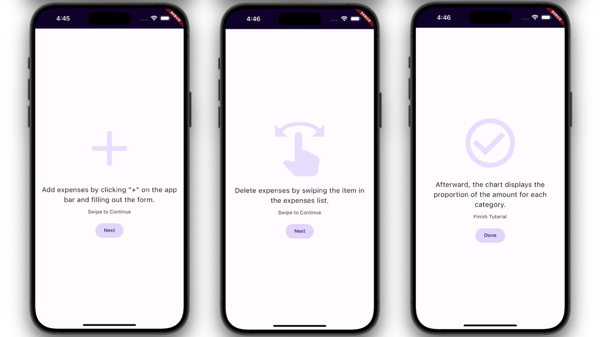

# Expense Tracker App with Parallax Scrolling

An advanced version of the [Expense Tracker App](https://github.com/rogerchang1108/Expense-Tracker-App-with-Flutter) has been developed using Flutter and Dart. In this project, users can access swipeable tutorial pages by clicking the "i" button on the app bar. The tutorial pages feature content with Parallax Scrolling. Additionally, the expense list now includes Parallax Scrolling background pictures for each expense item.

## Features

1. The app now has **Sliver AppBar** and **Sliver ExpensesList** in Portrait mode.

2. The expense list includes **Parallax Scrolling** background pictures for each expense item.

   

3. The app now will do re-layout in Landscape mode. 
 
   

4. An **"i"** button on the appbar to navigate to an **tutorial page**

5. A swipaeble tutorial with pages is available now.
    - The pages are left-right swipeable

    

5. There are **Parallax Scrolling** effects on each widget of the tutorial page
    - The text moves at 1.5x moving speed of icon
    - The button moves at 2.5x moving speed of icon
    - Button: **"Next"** scroll to the next page, **"Done"** dismiss the tutorial
      
    

## Resources

- [PageView](https://api.flutter.dev/flutter/widgets/PageView-class.html)
- [PageController](https://api.flutter.dev/flutter/painting/TextStyle-class.html)

